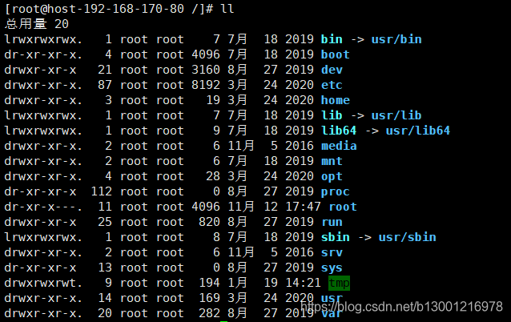
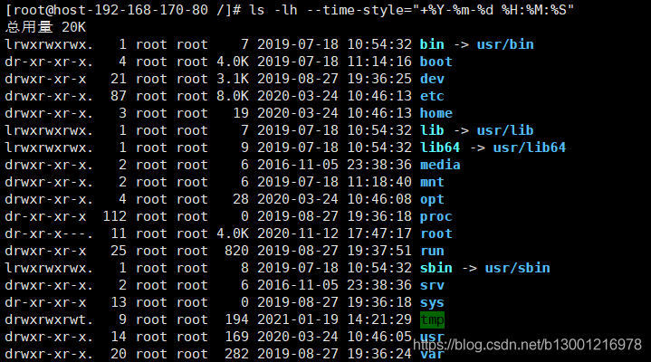

# Linux ls查看年月日时分秒 #

订阅专栏
直接使用ls命令和ll命令查看的时间一般看不到年

下面命令可以看到熟悉的样式，而且-h可以看到k，M这种可读性比较好的文件大小

    ls -lh --time-style="+%Y-%m-%d %H:%M:%S"

 

 
————————————————

版权声明：本文为CSDN博主「riabai」的原创文章，遵循CC 4.0 BY-SA版权协议，转载请附上原文出处链接及本声明。

原文链接：https://blog.csdn.net/b13001216978/article/details/112836367