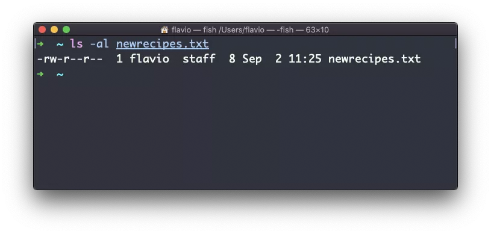
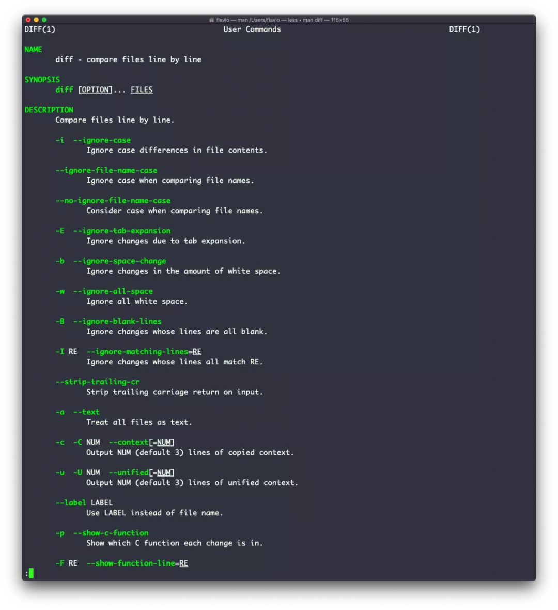
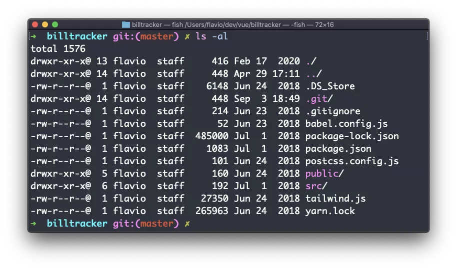
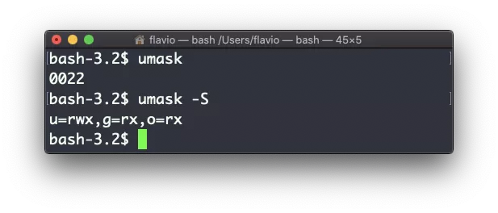

# Linux 命令完全手册（上） #

原创 Monstorix freeCodeCamp 2021-12-16 17:54


图片


这本《Linux 命令手册》将涵盖你作为开发者需要用到的 60 个核心 Bash 命令。每个命令都附有代码示例和用法提示。

这本手册遵循二八定律：你花两成的时间学习一个主题，便可获得其中八成的知识。

我觉得这种方式能给你一个全面的概述。

这本手册并不试图涵盖所有关于 Linux 及其命令的内容，而是专注于那些你在大部分时间里都会用到的小型核心命令，同时试着简化更复杂命令的用法。

以下介绍的命令，在 Linux、macOS、WSL 和其他类 UNIX 环境均可使用。

我希望这本手册的内容可以帮助你达成你想要的目标：熟练掌握 Linux 。

你可以收藏本页，这样就能在以后随时参考这本手册。

你也可以免费下载这本书的 PDF、ePUB、Mobi 版本。

尽情享受吧！

## 目录 ##

- Linux 和 Shell 简介
- Linux 中的 man 命令
- Linux 中的 ls 命令
- Linux 中的 cd 命令
- Linux 中的 pwd 命令
- Linux 中的 mkdir 命令
- Linux 中的 rmdir 命令
- Linux 中的 mv 命令
- Linux 中的 cp 命令
- Linux 中的 open 命令
- Linux 中的 touch 命令
- Linux 中的 find 命令
- Linux 中的 ln 命令
- Linux 中的 gzip 命令
- Linux 中的 gunzip 命令
- Linux 中的 tar 命令
- Linux 中的 alias 命令
- Linux 中的 cat 命令
- Linux 中的 less 命令
- Linux 中的 tail 命令
- Linux 中的 wc 命令
- Linux 中的 grep 命令
- Linux 中的 sort 命令
- Linux 中的 uniq 命令
- Linux 中的 diff 命令
- Linux 中的 echo 命令
- Linux 中的 chown 命令
- Linux 中的 chmod 命令
- Linux 中的 umask 命令
- Linux 中的 du 命令
- Linux 中的 df 命令
- Linux 中的 basename 命令
- Linux 中的 dirname 命令
- Linux 中的 ps 命令
- Linux 中的 top 命令
- Linux 中的 kill 命令
- Linux 中的 killall 命令
- Linux 中的 jobs 命令
- Linux 中的 bg 命令
- Linux 中的 fg 命令
- Linux 中的 type 命令
- Linux 中的 which 命令
- Linux 中的 nohup 命令
- Linux 中的 xargs 命令
- Linux 中的 vim 编辑器命令
- Linux 中的 emacs 编辑器命令
- Linux 中的 nano 编辑器命令
- Linux 中的 whoami 命令
- Linux 中的 who 命令
- Linux 中的 su 命令
- Linux 中的 sudo 命令
- Linux 中的 passwd 命令
- Linux 中的 ping 命令
- Linux 中的 traceroute 命令
- Linux 中的 clear 命令
- Linux 中的 history 命令
- Linux 中的 export 命令
- Linux 中的 crontab 命令
- Linux 中的 uname 命令
- Linux 中的 env 命令
- Linux 中的 printenv 命令
- 结语

## Linux 和 Shell 简介 ##

**什么是 Linux？**

Linux 是一种操作系统， 就像 macOS 和 Windows 一样。

它也是最流行的开放源代码操作系统，给予用户很大的自由度。

它驱动了绝大多数的互联网服务器，是构建任何设施的“地基”，但还不仅如此。Android 操作系统（中文也称“安卓”）实际上是基于（一种修改版的）Linux 构建的。

Linux 的“内核” （我们称之为 kernel ）诞生于 1991 年的芬兰，从最初的简陋构造到今天，已经走了很长的一段路。后来它成为了 GNU 操作系统的内核，于是出现了 GNU/Linux 组合系统。

Linux 可以让你拥有用计算机做任何事情的自由。这是微软、苹果、谷歌这样的大公司永远不会向用户提供的。

他们实际走的是另一条路：创造生态壁垒，尤其是在移动端。

而 Linux 代表着无尽的自由。

它的开发人员通常来自社区志愿者，这其中一些人是独立参与开发工作的，还有一些人是由于受雇于使用它的公司而参与的，但从来没有任何一家商业公司可以擅自决定 Linux 所含的内容，或者是某个项目的优先级。

你可以将 Linux 作为日常使用的系统。我当前使用 macOS ，因为我很喜欢它的应用程序和界面设计（同时我也是一名 iOS 和 Mac 应用开发者）。但在此之前，我一直使用 Linux 作为我的主要计算机操作系统。

在 Linux 上面，没有人能够支配你可以运行哪些应用程序，或者使用特定的应用程序收集你的个人资料、位置和其他信息。

Linux 还有一个特别之处，那就是“世界上不只有一个 Linux”，这和 Windows 还有 macOS 是不一样的。对于 Linux，我们有发行版的概念。

发行版通常由某个公司或组织制作，他们会将 Linux 内核和一些额外的程序与工具整合在一起。

例如，你也许使用过 Debian、Red Hat、Ubuntu，这些可能是最流行的发行版了。

但实际上还有更多。你甚至还可以制作属于你自己的发行版。然而在大多数情况下，人们会选择一个流行的发行版，因为这些版本通常有大量的用户，以及完善的社区支持。这可以让你花更少的时间，做更多的事，既不需要重复造轮子，同时查找某个问题的解决方案也更为方便。

某些台式电脑或笔记本电脑在出厂时预装了 Linux。但你也可以在 Windows 或 Mac 电脑上手动安装它。

不过，如果你只是想了解 Linux 的运行方式，那么没有必要去打乱现有的电脑系统。

我自己并没有专门的 “Linux 电脑”。

如果你在使用 Mac，你只需要了解一件事：抛去外壳，macOS 实际上是一种 UNIX 操作系统，而 GNU/Linux 是 UNIX 的自由替代品，因此 macOS 和 GNU/Linux 在很多理念和一些软件的使用上，是共通的。

    UNIX 是对 20 世纪 70 年代开始在一些大型公司和机构中使用的多种操作系统的统称。

在 macOS 的终端里，你同样可以使用我在这本手册中介绍的任何命令。

微软官方提供了适用于 Linux 的 Windows 子系统，你可以（甚至是有必要！）将其安装在 Windows 上。这让在 PC 上运行 Linux 有了一种更简单的方式。

但大多数时候，人们会通过 VPS （虚拟专用服务器，如 DigitalOcean） 在云端运行 Linux 电脑。

**什么是 Linux 的 Shell？**

Shell 通常指的是命令行界面的解析器，简单来说，它给用户提供一个操作界面，来访问底层的操作系统内核进行工作。

它可以让你使用文本和命令执行操作，同时还提供诸如创建脚本之类的高级功能。

这很重要：Shell 为用户提供了一种比 GUI （图形用户界面）更为高效的方式来做事。命令行工具可以提供更多不同的参数设置，但用起来不会变得太复杂。

Shell 有很多种，这里主要介绍 Unix shell，通常在 Linux 和 macOS 电脑上都可以见到。

经过长年发展，很多人为这些系统开发了不同种类的 Shell。其中有一些是最主要的，比如 Bash、Csh、Zsh、Fish 等，当然还有更多。

所有的 Shell 都从 Bourne Shell 发展而来，我们把它叫做 sh。名字中的 “Bourne” 是取自它的创建人——史蒂夫 · 伯恩（Steve Bourne）。

Bash 的全称是 Bourne-again shell。sh 是专有软件，并不开放源码，Bash 则在 1989 年由 GNU 计划和自由软件基金会创建，意在为其提供一个免费的替代品。由于 Bourne shell 需要付费才能在项目中使用，因而 Bash 变得非常流行。

如果你在使用 Mac，可以试试打开终端，默认的 Shell 一般是 ZSH（在 Catalina 版本之前，默认是 Bash）。

你可以在你的系统上配置和运行各种 Shell，譬如我使用的是 Fish shell。

每一种 Shell 都有其独特的功能和高级的用法，但在大多数的操作上是相通的：它们可以让你执行程序，你也可以对它们进行编程。

在本手册的余下部分，我们将详细探究那些人们最常用到的命令。

**Linux 中的 man 命令**

我们要介绍的第一条命令，将帮助你了解剩下的其他命令。

每当我不记得某条命令的用法时，我会输入 man <命令名> 获取它的说明：


图片

这是一个 man （取自 manual 的缩写）页面。Man 页面是你学习开发时的必备工具。它通常包含非常多的信息（有时几乎可以说太多了！）。上方的屏幕截图，实际上只是 ls 命令的 14 页用法指南中的第 1 页。

大多数时候，如果我需要快速了解某个命令的用法，我会访问一个叫做 tldr pages 的网站（https://tldr.sh）。它也可以作为一条命令安装在你的电脑上。比如，你可以运行 tldr <命令名> ，它就会快速提供这条命令的概述，以及一些常见的使用场景和用法指引：


图片

需要注意的是，这条命令并不是 man 的替代品，而只是一个帮助你摆脱迷失在 man 页面上大量信息里的便利工具。之后你还是可以在 man 页面查阅某个命令可用的不同选项和详细参数。

**Linux 中的 ls 命令**

在文件夹内，你可以使用 ls 命令列出其中包含的全部文件：

	ls

如果你在后面加上别的文件夹名字或者路径，它就会列出那个文件夹的内容：

	ls /bin


图片

ls 支持很多参数。我喜欢的其中一个是 -al 。试试看：

	ls -al /bin


图片

与常规的 ls 命令相比，这会返回更多的信息。

你可以看到（从左至右）：

- 文件权限（如果你的系统支持 ACL，这里也会有一个 ACL 标识）
- 链接到该文件的数量
- 该文件的所有者
- 该文件的用户组
- 文件大小（单位为字节）
- 文件最后的修改日期
- 文件名

这串数据是由 l 参数产生的，而 a 参数则用来包含被隐藏的文件。

隐藏文件的文件名通常以英文句号（ . ）开头。

**Linux 中的 cd 命令**

假如有一个文件夹，那么你可以用 cd 命令来打开它。cd 是 change directory（改变目录）的缩写。同样，你可以在后面加上文件夹的名字，或完整的路径，来访问某个特定的文件夹。

示例：

	mkdir fruits
	cd fruits

现在你进入了 fruits 文件夹。

你可以使用 .. 这个特殊的路径来代指上级目录。

	cd .. #回到上级目录

在这里，井号（#）表示注释的开始，在它之后的整行内容都是注释。

.. 也可以用来组成路径：

    mkdir fruits
    mkdir cars
    cd fruits
    cd ../cars

另一个特殊路径是 .，它指代的是当前所在的文件夹。

你也可以使用绝对路径，也就是从根文件夹 / 开始的位置：

    cd /etc

**Linux 中的 pwd 命令**

如果你在文件系统里迷路了，输入 pwd ，它会显示你现在的位置：

    pwd

这条命令输出当前所在文件夹的路径。

**Linux 中的 mkdir 命令**

使用 mkdir 命令创建新的文件夹：

    mkdir fruits

这条命令还可以一次创建多个文件夹：

    mkdir dogs cars

你也可以添加 -p 参数，创建多个嵌套的文件夹：

mkdir -p fruits/apples
UNIX 命令的参数通常都是这样的形式，只需要在命令的名字之后加上它们，就可以改变命令的工作方式。你可以同时使用多个参数。

你可以通过 Man 页面查找某个命令支持的具体参数，只需要输入 man <命令名>。现在，你可以试试输入 man mkdir，来查看这一命令的参数（按下字母q以退出 Man 页面）。Man 页面是 UNIX 上非常棒的内置帮助系统。

**Linux 中的 rmdir 命令**

如上所述，mkdir 命令可以创建文件夹，与之相反，rmdir 命令用来删除文件夹：

    mkdir fruits
    rmdir fruits

这个命令也可以一次删除多个文件夹：

    mkdir fruits cars
    rmdir fruits cars

用这个命令删除的文件夹，必须是空的。

如果要删除含有内容的文件夹，这里有一个更通用的命令：rm ，配合 -rf 参数即可同时删除文件夹和其中的文件：

    rm -rf fruits cars

请小心操作，这个命令在执行时不会向你确认，而是立刻删除你指定的文件。

用命令行删除文件，是没有回收站存在的，恢复丢失的文件会很难。

**Linux 中的 mv 命令**

当你有一个文件时，你可以用 mv 命令移动它。只需要指定文件的当前路径和新路径：

    touch test
    mv pear new_pear

文件 pear 现在被移动到 new_pear 了。这也是为文件和目录进行重命名的方法。

如果你指定的最后路径是一个文件夹，那么前面路径中的文件将被移动到那个文件夹。这时，你可以列出一组要移动的文件，这些文件将被移动到最后一个参数中指定的路径：

    touch pear
    touch apple
    mkdir fruits
    mv pear apple fruits #文件 pear 和 apple 被移动到 fruits 文件夹

**Linux 中的 cp 命令**

cp 命令可以用来复制文件：

    touch test
    cp apple another_apple

要复制整个文件夹，可以添加 -r 参数来递归复制那个文件夹的内容：

    mkdir fruits
    cp -r fruits cars

**Linux 中的 open 命令**

open 命令可以让你打开任意一个文件，格式如下：

    open <命令名>

你也可以用它打开目录。在 macOS 上，这个命令会打开访达（Finder）并显示你当前指定的目录：

    open <目录名>

我一直使用下面的命令打开当前目录：

    open .

特殊符号 . 代指当前目录， 而 .. 代指上级目录。

此外，它还可以用来打开一个应用程序：

    open <应用程序名>

**Linux 中的 touch 命令**

touch 命令可以用来创建空白的文件：

    touch apple

如果指定的文件已经存在，那么它将以写入模式打开文件，文件的时间戳（修改日期）也同时更新。

**Linux 中的 find 命令**

find 命令可以用来按特定的模式搜索文件和文件夹。它以递归的方式进行搜索。

让我们通过几个例子来学习它的用法。

你可以用下面的命令，查找当前目录树下所有扩展名为 .js 的文件，并输出每个匹配文件的相对路径：

    find . -name '*.js'

在星号（*）等特殊字符周围打上引号是很重要的，这可以避免 Shell 弄错它们的意义。

如果要查找在当前目录树下，所有与"src"这一名称匹配的目录，请输入：

    find . -type d -name src

同理，如果只搜索文件，可以使用 -type f 参数；如果只搜索符号链接，可以使用 -type l 参数。

-name 参数对于大小写敏感。如果不需要区分大小写，你应该使用 -iname 参数。

你可以在不同的根目录树下搜索文件：

    find folder1 folder2 -name filename.txt

要在当前目录树下搜索名称为 "node_modules" 或是 'public' 的目录，请输入：

    find . -type d -name node_modules -or -name public

你可以用 -not -path 参数排除某个路径：

    find . -type d -name '*.md' -not -path 'node_modules/*'

你还可以搜索当前目录树中内容超过 100 个字符（字节）的文件：

    find . -type f -size +100c

搜索大于 100KB，但小于 1MB 的文件：

    find . -type f -size +100k -size -1M

搜索至少 3 天前编辑的文件：

    find . -type f -mtime +3

搜索最近 24 小时编辑的文件：

    find . -type f -mtime -1

你可以使用 -delete 参数同步删除搜索到的文件。比如，下面的命令会删除最近 24 小时编辑的文件：

    find . -type f -mtime -1 -delete

你还可以在每个搜索结果上同时运行某个命令。在这里，我们运行 cat 来输出搜索到的文件的内容：

    find . -type f -exec cat {} \;

请注意结尾的 \; 。命令执行时，搜索结果中的文件名会被自动填入花括号 {} 。

**Linux 中的 ln 命令**

ln 命令是 Linux 诸多文件系统命令的一部分。

它的用途是创建链接。“链接”是什么？链接就像是指针，指向另一个文件，或者说是指向另一个文件的文件。你可能熟悉 Windows 上的快捷方式，二者是类似的。

我们有两种类型的链接：硬链接和软链接。

**硬链接**

硬链接现在很少使用。它有一些弱点：你无法链接到目录，也无法链接到外部文件系统（磁盘驱动器）。

要创建一个硬链接，可以使用下面的语法：

    ln <源文件路径> <链接路径>

例如，你有一个叫做 recipes.txt 的文件，你可以用下面的写法创建一个硬链接：

    ln recipes.txt newrecipes.txt

这个新创建的硬链接和普通的文件没有什么区别：


图片

现在，如果你编辑这对文件中的任何一个，另一个文件的内容也会随之更新。

即使你删除了源文件，链接文件仍然会包含源文件的内容。那是因为直到创建硬链接时，源文件还没有被删除。


图片

**软链接**

软链接则有所不同，它更为强大一些，你可以用它链接到其他的文件系统和目录。但请注意，当你删除源文件时，这个链接会断掉。

你可以使用 ln 命令的 -s 参数创建一个软链接：

    ln -s <源文件路径> <链接路径>

例如，你有一个叫做 recipes.txt 的文件。你可以用下面的写法为它创建一个软链接：

    ln -s recipes.txt newrecipes.txt

这种情况下，当你用 ls -al 列出文件时，你可以看见一个特殊的 l 标记。在文件名的末尾有一个 @ 符号，如果你启用了终端的显色，文件名还会有不同的颜色：


图片

现在，如果你删除源文件，链接就会断掉，如果你在终端里尝试访问它，Shell 会提示 "No such file or directory" （没有这个文件或目录）：


图片

**Linux 中的 gzip 命令**

你可以使用 gzip 命令，从而使用一种称为 LZ77 的 gzip 压缩协议，来压缩文件。

以下是最简单的用法：

    gzip 文件名

这会压缩指定的文件，并为它加上 .gz 扩展名。源文件会被删除。

如果不想删除源文件，你可以加上 -c 参数，然后使用输出重定向，将输出文件写到 filename.gz 中。

    gzip -c filename > filename.gz

-c 参数用来指定输出文件进入标准输出流，同时保持原始文件的完整性。

或者使用 -k 参数：

    gzip -k 文件名

文件有不同的压缩率。压缩率越高，压缩（或者解压）的时间就越长。压缩率等级一般从 1（速度最快，压缩效果最差）开始，直到 9 （速度最慢，压缩效果更好）结束。默认为 6 。

你可以用 -<数字> 参数指定使用的压缩率：

    gzip -1 文件名

你可以压缩多个文件，只需要依次列出它们：

    gzip file1 file2

你可以用递归的方式压缩某个目录包含的全部文件，只需要使用 -r 参数：

    gzip -r 文件夹路径

-v 参数会输出文件压缩时的百分比信息。以下是它和 -k （Keep 的简写） 参数并用时的情形：


图片

gzip 命令也可以用来解压文件，只需使用 -d 参数：

    gzip -d filename.gz

**Linux 中的 gunzip 命令**

gunzip 命令与 gzip 命令基本等同，但前者总是默认启用后者的 -d 参数。

可以用下面的方式调用这个命令：

    gunzip filename.gz

这会执行解压，将压缩文件的 .gz 扩展名去除，并将结果放进 filename 文件中。如果相应文件已经存在，将会被提取结果覆盖。

你可以加上 -c 参数，使用输出重定向，将压缩文件解压到不同的文件名：

    gunzip -c filename.gz > 另一个文件名

**Linux 中的 tar 命令**

tar 命令可以用来创建档案包，将多个文件打包为一个文件。

它的名称来源于旧时，意思是 tape archive（磁带档案） （很久以前档案都是用磁带存储的）。

下面的命令会将 file1 和 file2 打包成一个名为 archive.tar 的档案包文件：

	tar -cf archive.tar file1 file2

c 参数是 create（创建） 的简写。f 参数则用来将合成的档案包写入一个文件。

要在当前文件夹下的某个档案包中提取文件，可以使用如下命令：

	tar -xf archive.tar

参数 x 是 extract（提取） 的简写。

如果要提取文件到指定目录，应该使用下面的命令：

	tar -xf archive.tar -C 目录路径

你也可以不提取文件，只罗列某个档案包里含有的文件列表：


图片

tar 常用来创建压缩档案包。

这可以用 z 参数来完成：

    tar -czf archive.tar.gz file1 file2

这就像是先创建了一个 tar 档案包，再运行 gzip 来压缩它。

如果你要提取一个被压缩的档案包，可以先使用 gunzip 或 gzip -d 来解压，再提取里面的文件。除此之外 tar -xf 也可以直接识别压缩的档案包，然后为你完成解压提取操作：

    tar -xf archive.tar.gz

**Linux 中的 alias 命令**

通常情况下，人们总会使用一组喜欢的参数去运行一个程序。

此处用 ls 命令举例。默认情况下，它只输出少量的信息：


图片

但如果你带上了 -al 参数，它会输出一些更有用的信息，像是文件的修改日期、大小、所有者、权限之类。它也会同时列出隐藏的文件（文件名以英文句号. 开头的文件）：


图片

你可以创建一个新的命令，比如我喜欢叫它 ll，它是 ls -al 命令的一个别名。

方法如下所示：

    alias ll='ls -al'

只要这么做了，你就可以像使用普通的 UNIX 命令一样，调用 ll ：


图片

当调用 alias ，但不加任何参数时，它会列出已经定义的所有别名：


图片

用以上方法定义的别名，在终端会话关闭后就会失效。

如果要让别名永久有效，你必须将其添加到 Shell 的配置文件中。如果你正在使用 Bash shell，配置文件可能是 ~/.bashrc 、~/.profile 或 ~/.bash_profile ，依据实际用法而定。

如果你定义的命令中存在变量，那么请注意引号的用法：如果使用双引号，变量会在进行定义时解析；如果使用单引号，变量则会在命令被调用时解析。两者是不同的：

    alias lsthis="ls $PWD"
    alias lscurrent='ls $PWD'

$PWD 代表 Shell 当前所在的文件夹。如果你导航到新的文件夹，lscurrent 命令会列出新文件夹中的文件，而 lsthis 仍然会列出你首次定义变量时所在文件夹中的文件。

**Linux 中的 cat 命令**

cat 命令与后面会介绍到的 tail 命令有些相似，但 cat 命令可以向任一文件添加内容，这就使得它非常强大。

cat 最简单的用法是将任一文件的内容打印到标准输出中：

	cat 文件名

你可以打印输出多个文件的内容：

	cat file1 file2

配合输出重定向操作符 > ，你可以把多个文件的内容拼接成一个新的文件：

	cat file1 file2 > file3

使用操作符 >> ，你可以将多个文件的内容附加到任一文件中，如果目标文件不存在，则会新建一个：

	cat file1 file2 >> file3

当查看源代码时，读取行数是非常有用的。使用 cat 的参数 -n 即可完成：

	cat -n file1

使用 -b 参数可以（同时也只能）向文件的非空行添加一个数字。而使用 -s 参数则可以移除文件中所有的多行空行。

	cat 经常和管道符 | 一并使用，可以将任一文件的内容输入给另一个命令使用：cat 文件名1 | 另一个命令。

**Linux 中的 less 命令**

less 是我经常使用的命令之一。它透过一个漂亮的交互用户界面向你展示任一文件中存储的内容：

用法：less <文件名>。


图片

当你处于 less 会话时，按下 q 键即可离开。

你可以使用 上 键和 下 键浏览文件的内容，或者使用 空格 键和 b 键逐页浏览。按下 G 键（大写）可以跳转到文件的末尾，而按下 g 键（小写）则可以回到文件的开头。

按下左斜杠键 / 并输入文字，就可以在文件中进行搜索。这会 向前 搜索。如果要向后搜索，你需要使用问号 ? 并输入文字。

这个命令只是将文件的内容可视化。你可以直接按 v 打开一个编辑器。它将使用系统编辑器，在大多数情况下是 vim 。

按 F 键即可进入 跟踪模式，也称 观察模式。当文件被别人修改时，比如从另一个程序中修改，你就可以 实时 看到修改的内容。

默认状态下不会出现这种情况，你只能看到你打开文件时的文件版本。你需要按 ctrl-C 来退出这个模式。在这种情况下，行为类似于运行 tail -f <文件名> 命令。

你可以打开多个文件，并使用 :n （next，转到下一个文件）和 :p （previous，转到上一个文件）浏览它们。

**Linux 中的 tail 命令**

在我看来，tail 命令的最佳用法是带上 -f 参数一起调用。它会打开并显示文件最末尾的内容，并实时监控文件的改动。

有新内容进入文件时，它就将其输出到终端窗口中。这对于查看日志文件是非常棒的。例如：

	tail -f /var/log/system.log

要退出，就按下 ctrl-C.

使用以下命令，你可以输出任一文件的最后十行内容：

	tail -n 10 <文件名>

你还可以在行号前添加加号 + 指定从文件的某一行开始输出之后的所有内容：

	tail -n +10 <文件名>

tail 还可以做更多的事情，像往常一样，我建议你去查询 man tail 了解更多。

**Linux 中的 wc 命令**

wc 命令会为我们显示关于指定文件（或透过管道符接收的参数）的有用信息。

    echo test >> test.txt
    wc test.txt
    1   1   5 test.txt

以下是透过管道符的例子，我们可以利用它来给 ls -al 命令的运行输出计数：

    ls -al | wc
    6  47 284

第一列返回的是行数，第二列是字数，第三列则是比特数。

我们可以让它只计算行数：

	wc -l test.txt

或者只计算字数：

	wc -w test.txt

或者只计算比特数：

	wc -c test.txt

在 ASCII 字符集中，比特数等于字符数。但对于非 ASCII 字符集，由于一些字符可能占用多个比特，字符的数目可能会不同（这在 Unicode 里有发生过）。

这种情况下使用 -m 参数可以得到正确的数目：

	wc -m test.txt

**Linux 中的 grep 命令**

grep 命令是一个非常有用的工具。假若掌握了它，对日常的编码工作会有很大的帮助。

如果你比较好奇， grep 的全写是 global regular expression print （全局正则表达式打印）。

你可以使用 grep 在文件中进行搜索，或者与管道符配合使用，将输出结果传递到其他命令。

例如，可以用以下命令在 index.md 文件里搜寻 document.getElementById 这一行出现的次数：

	grep -n document.getElementById index.md


图片

使用 -n 参数可以显示行号：

	grep -n document.getElementById index.md


图片

一个非常有用的方法是告诉 grep 在相应行的前后各输出 2 行，以提供更多的上下文。这可以用参数 -C 来完成，它可以受取其后的若干行数：

	grep -nC 2 document.getElementById index.md


图片

搜索默认是区分大小写的。使用参数 -i 可以使其不再区分。

如上所述，你可以使用 grep 来过滤其他命令的输出。我们可以使用以下方法重现前述的功能：

	less index.md | grep -n document.getElementById


图片

搜索字符串中可以使用正则表达式，这让 grep 变得非常强大。

另一个你可能发现很有用的方法是——使用参数 -v 反转结果，排除与特定字符串匹配的行：


图片

**Linux 中的 sort 命令**

假定你有一份文本文件，里面包含一些狗狗的名字：


图片

这串名字并没有进行排序。

而 sort 命令会帮你按照名称顺序排列它们：


图片

使用 r 参数倒转排序结果：


图片

默认情况下，排序区分大小写，并且遵循英文字母顺序。使用 --ignore-case 参数进行不区分大小写的排序，使用 -n 参数可按数值大小顺序进行排序。

如果文件包含重复的行：


图片

你可以使用 -u 参数移除它们：


图片

sort 命令不像多数 UNIX 命令那样，只是用于操作文件，它还可以与管道符配合使用。因此你可以将它用在其他命令的输出上。例如，你可以用它排序 ls 命令传回的文件列表：

	ls | sort

sort 的功能非常强大，它还支持更多的参数，你可以输入 man sort 来探索：


图片

**Linux 中的 uniq 命令**

uniq 命令可以帮助你排序文本文件中的行。

这些行可以通过文件获取，或用管道符从另一个命令的输出中得到：

    uniq dogs.txt
    ls | uniq

此处需要考虑一个关键点：uniq 只会检测相邻的重复行。

这意味着你可能会将它与 sort 配合使用：

	sort dogs.txt | uniq

sort 命令拥有自己的参数—— -u (unique) 来移除重复的行。但 uniq 更为强大。

默认情况下，它会删除重复的行：


图片

你可以告诉它只是显示重复的行，例如，使用 -d 参数：

	sort dogs.txt | uniq -d


图片

还可以使用 -u 参数，那样就只会显示不重复的行：


图片

使用 -c 参数计算每一行的出现次数：


图片

使用以下的特殊命令组合：

	sort dogs.txt | uniq -c | sort -nr

即可将文件内的行按最常见的频率排序：


图片

Linux 中的 diff 命令
diff 是一个非常方便的命令。假定有两个文件，它们包含几乎相同的信息，你没有办法找出区别。

diff 会处理文件，然后告诉你有差异的地方。

假定有两个文件：dogs.txt 和 moredogs.txt。它们的区别是：moredogs.txt 比前者多了一条狗狗的名字：


图片

diff dogs.txt moredogs.txt 会告诉你后者多了一行，在第 3 行有 Vanille 这一行：


图片

如果你改变两个文件的顺序，它会告诉你后者的第三行丢失了，也就是 Vanille 那一行：


图片

使用 -y 参数会逐行对比两个文件：


图片

你可能更熟悉 -u 参数，因为在 Git 版本管理系统中，它一样是用来显示不同版本文件差异的：


图片

对于目录，比较的方式是一样的。你必须使用 -r 选项来进行递归比较（进入子目录）：


图片

如果你只对哪个文件存在差异感兴趣，而非关注文件的内容，可以使用 r 和 q 参数：


图片

它还支持更多参数，你可以用 man 页面来探索，只需键入 man diff：


图片

**Linux 中的 echo 命令**

echo 命令会做一件简单的事情：它将传递给自身的参数打印输出。

以下示例：

	echo "hello"

会将 hello 输出到终端。

我们可以将输出追加到文件中：

	echo "hello" >> output.txt

我们可以对环境变量进行插值：

	echo "The path variable is $PATH"


图片

注意，特殊字符需要用反斜杠进行转义。以 $ 为例：


图片

这只是个开始。当与 Shell 功能交互时，我们可以用它来做一些很棒的事情。

我们可以输出当前文件夹中的文件：

	echo *

我们还可以输出当前文件夹中所有以字母 o 开头的文件：

	echo o*

任何有效的 Bash（或者是你使用的其他 Shell）命令和功能可以在此使用。

你可以输出你的主文件夹（home）的路径：

	echo ~


图片

你还可以执行命令，并且将执行结果打印到标准输出（或者是文件，正如你看到的）：

	echo $(ls -al)


图片

注意，输出在默认情况下不保留空白。如需留白，必须用双引号来包裹命令：


图片

你可以用它生成字符串列表，例如指定一个范围：

	echo {1..5}


图片

**Linux 中的 chown 命令**


在 Linux 或 macOS 操作系统（或是任一 UNIX 系统）中，每个文件或目录都有所有者。

所有者可以对文件做任何事情。它可以决定文件的命运。

使用 chown 命令，所有者（以及 root 用户）也可以将文件所有权转移给另一个用户：

	chown <所有者> <文件>

像这样：

	chown flavio test.txt

例如，假设有一个为 root 所拥有的文件，作为其他用户，你无法对它进行写入：


图片

你可以使用 chown 将文件所有权转移到你：


图片

一种需求十分常见：改变目录的所有权，同时遍历修改其中包含的文件、子目录以及子目录中的文件的所有权。


你可以使用 -R 参数来完成：

	chown -R <所有者> <文件>

文件和目录不仅属于所有者，同时还属于用户组。使用以下命令，你可以在变更所有者的同时，更改其所属用户组：

	chown <所有者>:<用户组> <文件>

举例：

	chown flavio:users test.txt

你还可以使用 chgrp 命令，只更改文件的所属用户组：

	chgrp <用户组> <文件名>

**Linux 中的 chmod 命令**

在 Linux 或 macOS 操作系统（或是任一 UNIX 系统）中，每个文件都有三种权限：读取、写入和执行。

进入一个文件夹，并运行 ls -al 命令。



图片

你在文件列表每一行见到的，像是 drwxr-xr-x 这样的奇怪字符串，定义了文件或文件夹的权限。


让我们来剖析一下。

第一个字母表示文件的类型：

```
- 表示这是一个常规的文件
d 表示这是一个目录
l 表示这是一个链接
```

之后你就有了三组值：

- 第一组代表文件所有者拥有的权限
- 第二组代表文件所关联的用户组成员拥有的权限
- 第三组代表其他人拥有的权限

这些组由三个值组成。rwx 代表特定 角色 拥有读取、写入和执行访问权限。任何被移除的权限会被替换为 - ，因此你可以将不同的值，及其代表的相关权限进行组合：例如 rw-、r--、r-x` 等等。

你可以使用 chmod 命令来改变一个文件的权限。

chmod 有两种用法。其一是使用符号参数，其二是使用数字参数。首先来试试更为直观的符号参数。

终端输入 chmod ，空格，之后加上一个字母：

- a 表示 all，即全体
- u 表示 user，即用户
- g 表示 group，即用户组
- o 表示 others，即其他人

然后输入 + 或 - 并加上一个或多个权限符号（r、w、x），来添加或删除任意权限。

键入以上所有命令和参数之后，都要加上文件或文件夹名称。

以下是一些例子：

    chmod a+r filename #每个人都可以读取
    chmod a+rw filename #每个人都可以读取和写入
    chmod o-rwx filename #其他人（非文件所有者，也不在文件所属用户组中的用户）无法读取、写入或执行文件

只需要在 +/- 前添加多个字母，即可将相同的权限批量应用到不同的身份：

	chmod og-r filename #其他人，和用户组无法读取文件。

如果你正在编辑一个文件夹，你可以使用 -r（递归）参数将权限应用到该文件夹中的每个文件。

使用数字参数速度更快，但我认为当你不是每天都使用的话，是很难记住它们的。数字在此代表任一角色的权限。这个数字值最大可以是7，它是这样计算的：

- 拥有执行权限，记为 1
- 拥有写入权限，记为 2
- 拥有读取权限，记为 4

这又给我们带来四种组合：

- 0 代表无权限
- 1 代表可以执行
- 2 代表可以写入
- 3 代表可以写入和执行
- 4 代表可以读取
- 5 代表可以读取和执行
- 6 代表可以读取和写入
- 7 代表可以读取、执行和写入

我们使用三组数字，来同时设置所有 3 个用户身份的全部权限：

- chmod 777 filename
- chmod 755 filename
- chmod 644 filename

**Linux 中的 umask 命令**

创建一个文件时，不需要事先决定权限。权限有默认值。

这些默认值可以使用 umask 命令来控制和修改。

不带参数输入 umask ，它会显示当前的 umask 值，本例中为 0022：


图片

0022 是什么意思？这是一个代表权限的八进制数值。

另一个常见的数值是 0002.

使用 umask -S 查看更具可读性的注释：



图片

在这里，用户（u），也就是文件的所有者，拥有对文件的读取、写入和执行的权限。


和所有者位于同一用户组的用户（g）拥有对文件的读取和执行权限，除此之外的其他用户（o）也一样。

在数字符号中，我们通常会改变最后3位数字。

以下列表给出了这些数字的含义：

- 0 代表读取、写入与执行
- 1 代表读取与写入
- 2 代表读取与执行
- 3 代表只读
- 4 代表写入与执行
- 5 代表仅写入
- 6 代表仅执行
- 7 代表没有权限

注意，这里的数字含义与前述 chmod 命令中用到的并不同。

可以用数值格式，为权限掩码设置一个新的值：

	umask 002

也可以更改特定角色的权限：

	umask g+r

**Linux 中的 du 命令**

du 命令会计算整个目录的大小：

	du


图片

这里的 32 是一个单位为字节（Byte）的值。

运行 du * 会单独计算每个文件的大小：


图片

你也可以执行 du -m 或 du -g，以兆字节（MB）或千兆字节（GB）为单位显示文件大小。

使用 -h 选项，会显示更为可读的，适应大小的数值：


图片

添加 -a 选项同样会输出文件夹中每一个文件的大小：


图片

一个方便的做法是按大小对目录进行排序：

	du -h <directory> | sort -nr

然后通过管道输出到 head ，从而仅获取前 10 个结果：


图片

**Linux 中的 df 命令**

df 命令用来获取磁盘的使用情况信息。

它的基础形式会输出当前挂载的磁盘卷信息：


图片

使用 -h 参数 （df -h）会将值以更为可读的方式显示：


图片

你也可以指定任一文件或目录名，以获取其所在的特定卷的信息：


图片

**结语**

感谢你阅读这份命令指南。

我希望它会激发你去学习更多关于 Linux 及其能力的知识。这些知识就像是一棵常青树，不会很快过时。

请记住，如果你愿意，随时可以免费下载这本书的 PDF、ePUB、Mobi 版本！

如果想查看更多类似的精彩内容，我每天会在我的网站 flaviocopes.com 上发布编程教程。


原文链接：https://www.freecodecamp.org/news/the-linux-commands-handbook/

作者：Flavio Copes

译者：Monstorix


**在线贡献者交流会预告**

在线贡献者交流会将于北京时间 12 月 18 日周六下午 13:00 - 15:00 开展（每两周一次，都在这个时间段开展）。
欢迎大家添加小助手微信 fcczhongguo，加入会议室。


图片

非营利组织 freeCodeCamp.org 自 2014 年成立以来，以“帮助人们免费学习编程”为使命，创建了大量免费的编程教程，包括交互式课程、视频课程、文章等。我们的开源社区正在帮助全球数百万人学习编程，希望让世界上每个人都有机会获得免费的优质的编程教育资源，成为开发者或者运用编程去解决问题。
了解 freeCodeCamp 的新课程

✨✨

freeCodeCamp 关系数据库课程——通过 Docker 在 VSCode 中学习 SQL 和更多

freeCodeCamp 将上线开源免费的数据科学课程，欢迎参与贡献！