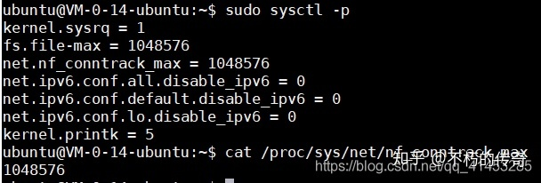

# linux服务器系统_Linux(服务器编程):百万并发服务器系统参数调优 #

## 一、本文目的 ##

在编写服务器时，如果服务器的设计初衷是要可以承担百万、千万的客户端连接，那么默认的情况下，Linux操作系统提供的相关配置参数（比如说进程可分配的文件数目等）是不能够满足我们的程序需求的，因此需要自己调整系统的相关参数

并发的概念是什么？什么是并发？

**对于服务器并发的概念，下面几点是错误的定义：**

- ①服务器处理客户端请求的数量：没有时间、空间等限制，因此不能作为并发的概念
- ②单位时间内，能够处理请求的数量：这也是不正确的定义，因为这个定义是针对于服务器吞吐量（qps）的，而不是并发
- 其他等......

**下面几点组成在一起可以作为服务器“并发”的概念：**

- ①服务器能够同时承担的客户端数量（最基本要求）
- ②能处理指定数量以上的相应请求
- ③能够对数据库进行操作
- ④有磁盘的操作
- ⑤CPU的占用率最好不要超过60%
- ⑥内存占用率最好不要超过80%

视频资料详解：

c/c++Linux实战训练精讲丨揭秘百万并发服务器的奥秘丨在线提升涨薪利器_哔哩哔哩 (゜-゜)つロ 干杯~-bilibili​www.bilibili.com

2ca907184be441428b88538732152d8b.png

c/c++Linux实战丨高并发场景下定时器的实现丨红黑树的实现_哔哩哔哩 (゜-゜)つロ 干杯~-bilibili​www.bilibili.com

956197b78fb5606a1b3949f9b00cf2cb.png

## 二、本文环境搭建 ##

**本文准备了两份代码，作为测试环境：**

- reactor.c：作为服务端，采用单进程reactor模式编写，持续接收客户端的连接，并且与客户端有数据的读写（recv()、send()）
- mul_port_client_epoll.c：作为客户端，会向reactor.c服务端发起不超过340000的客户端连接，并且每个客户端都会与服务端有数据的读写（recv()、send()）

**reactor.c**

Github源码链接参阅：https://github.com/dongyusheng/csdn-code/blob/master/server-client/reactor.c

```
// reactor.c
 
// 源码链接: https://github.com/dongyusheng/csdn-code/blob/master/server-client/reactor.c
 
#include <stdio.h>
 
#include <stdlib.h>
 
#include <string.h>
 
#include <sys/socket.h>
 
#include <sys/epoll.h>
 
#include <arpa/inet.h>
 
#include <fcntl.h>
 
#include <unistd.h>
 
#include <errno.h>
 
#include <time.h>
 
 
 
#define BUFFER_LENGTH		4096
 
#define MAX_EPOLL_EVENTS	1024
 
#define SERVER_PORT         8888
 
 
 
typedef int NCALLBACK(int ,int, void*);
 
 
 
struct ntyevent {
 
 int fd;      
 
 int events;  
 
 void *arg;  
 
 int (*callback)(int fd, int events, void *arg);
 
 int status;                 
 
 char buffer[BUFFER_LENGTH];
 
 int length;
 
 long last_active;
 
};
 
 
 
struct ntyreactor {
 
 int epfd;           
 
 struct ntyevent *events;
 
};
 
 
 
int recv_cb(int fd, int events, void *arg);
 
int send_cb(int fd, int events, void *arg);
 
int nty_event_set(struct ntyevent *ev, int fd, NCALLBACK callback, void *arg) {
 
	ev->fd = fd;
 
	ev->callback = callback;
 
	ev->events = 0;
 
	ev->arg = arg;
 
	ev->last_active = time(NULL);
 
 
 
 return 0;
 
}
 
 
 
int nty_event_add(int epfd, int events, struct ntyevent *ev) {
 
 
 
 struct epoll_event ep_ev = {0, {0}};
 
	ep_ev.data.ptr = ev;
 
	ep_ev.events = ev->events = events;
 
 
 
 int op;
 
 if (ev->status == 1) { 
 
		op = EPOLL_CTL_MOD;
 
	} else {
 
		op = EPOLL_CTL_ADD; 
 
		ev->status = 1;
 
	}
 
 
 
 if (epoll_ctl(epfd, op, ev->fd, &ep_ev) < 0) {
 
 printf("event add failed [fd=%d], events[%d]n", ev->fd, events);
 
 return -1;
 
	}
 
 
 
 return 0;
 
}
 
 
 
int nty_event_del(int epfd, struct ntyevent *ev) {
 
 
 
 struct epoll_event ep_ev = {0, {0}};
 
 if (ev->status != 1) {
 
 return -1;
 
	}
 
 
 
	ep_ev.data.ptr = ev;
 
	ev->status = 0;
 
	epoll_ctl(epfd, EPOLL_CTL_DEL, ev->fd, &ep_ev);
 
 
 
 return 0;
 
}
 
 
 
int recv_cb(int fd, int events, void *arg) {
 
 struct ntyreactor *reactor = (struct ntyreactor*)arg;
 
 struct ntyevent *ev = reactor->events + fd;
 
 
 
 int len = recv(fd, ev->buffer, BUFFER_LENGTH, 0);
 
	nty_event_del(reactor->epfd, ev);
 
 
 
 if (len > 0) {
 
 
 
		ev->length = len;
 
		ev->buffer[len] = '0';
 
 
 
 printf("C[%d]:%sn", fd, ev->buffer);
 
 
 
		nty_event_set(ev, fd, send_cb, reactor);
 
		nty_event_add(reactor->epfd, EPOLLOUT, ev);
 
 
 
 
 
	} else if (len == 0) {
 
 
 
		close(ev->fd);
 
 printf("[fd=%d] pos[%ld], closedn", fd, ev-reactor->events);
 
 
 
	} else {
 
 //if(errno == EAGAIN || errno == EWOULDBLOCK)
 
 //	continue;
 
 return 0;
 
 
 
		close(ev->fd);
 
 printf("recv[fd=%d] error[%d]:%sn", fd, errno, strerror(errno));
 
 
 
	}
 
 
 
 return len;
 
}
 
 
 
int send_cb(int fd, int events, void *arg) {
 
 
 
 struct ntyreactor *reactor = (struct ntyreactor*)arg;
 
 struct ntyevent *ev = reactor->events + fd;
 
 
 
 int len = send(fd, ev->buffer, ev->length, 0);
 
 if (len > 0) {
 
 printf("send[fd=%d], [%d]%sn", fd, len, ev->buffer);
 
		nty_event_del(reactor->epfd, ev);
 
		nty_event_set(ev, fd, recv_cb, reactor);
 
		nty_event_add(reactor->epfd, EPOLLIN, ev);
 
 
 
	} else {
 
		close(ev->fd);
 
		nty_event_del(reactor->epfd, ev);
 
 printf("send[fd=%d] error %sn", fd, strerror(errno));
 
	}
 
 
 
 return len;
 
}
 
 
 
int accept_cb(int fd, int events, void *arg) {
 
 struct ntyreactor *reactor = (struct ntyreactor*)arg;
 
 if (reactor == NULL) return -1;
 
 struct sockaddr_in client_addr;
 
 socklen_t len = sizeof(client_addr);
 
 int clientfd;
 
 if ((clientfd = accept(fd, (struct sockaddr*)&client_addr, &len)) == -1) {
 
 if (errno != EAGAIN && errno != EINTR) {
 
		}
 
 printf("accept: %sn", strerror(errno));
 
 return -1;
 
	}
 
 
 
 int i = 0;
 
 do {
 
 for (i = 0;i < MAX_EPOLL_EVENTS;i ++) {
 
 if (reactor->events[i].status == 0) {
 
 break;
 
			}
 
		}
 
 if (i == MAX_EPOLL_EVENTS) {
 
 printf("%s: max connect limit[%d]n", __func__, MAX_EPOLL_EVENTS);
 
 break;
 
		}
 
 
 
 int flag = 0;
 
 if ((flag = fcntl(clientfd, F_SETFL, O_NONBLOCK)) < 0) {
 
 printf("%s: fcntl nonblocking failed, %dn", __func__, MAX_EPOLL_EVENTS);
 
 break;
 
		}
 
		nty_event_set(&reactor->events[clientfd], clientfd, recv_cb, reactor);
 
		nty_event_add(reactor->epfd, EPOLLIN, &reactor->events[clientfd]);
 
	} while (0);
 
 printf("new connect [%s:%d][time:%ld], pos[%d]n", 
 
		inet_ntoa(client_addr.sin_addr), ntohs(client_addr.sin_port), reactor->events[i].last_active, i);
 
 return 0;
 
}
 
 
 
int init_sock(short port) {
 
 int fd = socket(AF_INET, SOCK_STREAM, 0);
 
	fcntl(fd, F_SETFL, O_NONBLOCK);
 
 struct sockaddr_in server_addr;
 
 memset(&server_addr, 0, sizeof(server_addr));
 
	server_addr.sin_family = AF_INET;
 
	server_addr.sin_addr.s_addr = htonl(INADDR_ANY);
 
	server_addr.sin_port = htons(port);
 
	bind(fd, (struct sockaddr*)&server_addr, sizeof(server_addr));
 
 if (listen(fd, 20) < 0) {
 
 printf("listen failed : %sn", strerror(errno));
 
	}
 
 return fd;
 
}
 
 
 
int ntyreactor_init(struct ntyreactor *reactor) {
 
 if (reactor == NULL) return -1;
 
 memset(reactor, 0, sizeof(struct ntyreactor));
 
	reactor->epfd = epoll_create(1);
 
 if (reactor->epfd <= 0) {
 
 printf("create epfd in %s err %sn", __func__, strerror(errno));
 
 return -2;
 
	}
 
	reactor->events = (struct ntyevent*)malloc((MAX_EPOLL_EVENTS) * sizeof(struct ntyevent));
 
 if (reactor->events == NULL) {
 
 printf("create epfd in %s err %sn", __func__, strerror(errno));
 
		close(reactor->epfd);
 
 return -3;
 
	}
 
 return 0;
 
}
 
 
 
int ntyreactor_destroy(struct ntyreactor *reactor) {
 
	close(reactor->epfd);
 
 free(reactor->events);
 
}
 
 
 
int ntyreactor_addlistener(struct ntyreactor *reactor, int sockfd, NCALLBACK *acceptor) {
 
 if (reactor == NULL) return -1;
 
 if (reactor->events == NULL) return -1;
 
	nty_event_set(&reactor->events[sockfd], sockfd, acceptor, reactor);
 
	nty_event_add(reactor->epfd, EPOLLIN, &reactor->events[sockfd]);
 
 return 0;
 
}
 
 
 
int ntyreactor_run(struct ntyreactor *reactor) {
 
 if (reactor == NULL) return -1;
 
 if (reactor->epfd < 0) return -1;
 
 if (reactor->events == NULL) return -1;
 
 struct epoll_event events[MAX_EPOLL_EVENTS+1];
 
 int checkpos = 0, i;
 
 while (1) {
 
 long now = time(NULL);
 
 for (i = 0;i < 100;i ++, checkpos ++) {
 
 if (checkpos == MAX_EPOLL_EVENTS) {
 
				checkpos = 0;
 
			}
 
 if (reactor->events[checkpos].status != 1) {
 
 continue;
 
			}
 
 long duration = now - reactor->events[checkpos].last_active;
 
 if (duration >= 60) {
 
				close(reactor->events[checkpos].fd);
 
 printf("[fd=%d] timeoutn", reactor->events[checkpos].fd);
 
				nty_event_del(reactor->epfd, &reactor->events[checkpos]);
 
			}
 
		}
 
 int nready = epoll_wait(reactor->epfd, events, MAX_EPOLL_EVENTS, 1000);
 
 if (nready < 0) {
 
 printf("epoll_wait error, exitn");
 
 continue;
 
		}
 
 for (i = 0;i < nready;i ++) {
 
 struct ntyevent *ev = (struct ntyevent*)events[i].data.ptr;
 
 if ((events[i].events & EPOLLIN) && (ev->events & EPOLLIN)) {
 
				ev->callback(ev->fd, events[i].events, ev->arg);
 
			}
 
 if ((events[i].events & EPOLLOUT) && (ev->events & EPOLLOUT)) {
 
				ev->callback(ev->fd, events[i].events, ev->arg);
 
			}
 
		}
 
	}
 
}
 
 
 
int main(int argc, char *argv[]) {
 
 unsigned short port = SERVER_PORT;
 
 if (argc == 2) {
 
		port = atoi(argv[1]);
 
	}
 
 int sockfd = init_sock(port);
 
 struct ntyreactor *reactor = (struct ntyreactor*)malloc(sizeof(struct ntyreactor));
 
	ntyreactor_init(reactor);
 
	ntyreactor_addlistener(reactor, sockfd, accept_cb);
 
	ntyreactor_run(reactor);
 
	ntyreactor_destroy(reactor);
 
	close(sockfd);
 
 return 0;
 
}
```

**mul_port_client_epoll.c**

Github源码链接参阅：https://github.com/dongyusheng/csdn-code/blob/master/server-client/mul_port_client_epoll.c

```
// mul_port_client_epoll.c
 
// 源码链接: https://github.com/dongyusheng/csdn-code/blob/master/server-client/mul_port_client_epoll.c
 
#include <stdio.h>
 
#include <string.h>
 
#include <stdlib.h>
 
#include <sys/types.h>
 
#include <sys/socket.h>
 
#include <sys/epoll.h>
 
#include <errno.h>
 
#include <netinet/tcp.h>
 
#include <arpa/inet.h>
 
#include <netdb.h>
 
#include <fcntl.h>
 
#include <unistd.h>
 
#include <time.h>
 
#include <sys/time.h>
 
 
 
#define MAX_BUFFER		128
 
#define MAX_EPOLLSIZE	(384*1024)
 
#define MAX_PORT		1
 
 
 
#define TIME_SUB_MS(tv1, tv2)  ((tv1.tv_sec - tv2.tv_sec) * 1000 + (tv1.tv_usec - tv2.tv_usec) / 1000)
 
 
 
int isContinue = 0;
 
 
 
static int ntySetNonblock(int fd) {
 
 int flags;
 
 
 
	flags = fcntl(fd, F_GETFL, 0);
 
 if (flags < 0) return flags;
 
	flags |= O_NONBLOCK;
 
 if (fcntl(fd, F_SETFL, flags) < 0) return -1;
 
 return 0;
 
}
 
 
 
static int ntySetReUseAddr(int fd) {
 
 int reuse = 1;
 
 return setsockopt(fd, SOL_SOCKET, SO_REUSEADDR, (char *)&reuse, sizeof(reuse));
 
}
 
 
 
 
 
 
 
int main(int argc, char **argv) {
 
 if (argc <= 2) {
 
 printf("Usage: %s ip portn", argv[0]);
 
 exit(0);
 
	}
 
 
 
 // 获取要连接的服务端的ip和端口
 
 const char *ip = argv[1];
 
 int port = atoi(argv[2]);
 
 
 
 int connections = 0;
 
 char buffer[128] = {0};
 
 int i = 0, index = 0;
 
 
 
 // 创建epoll
 
 struct epoll_event events[MAX_EPOLLSIZE];
 
 int epoll_fd = epoll_create(MAX_EPOLLSIZE);
 
 
 
 strcpy(buffer, " Data From MulClientn");
 
 
 
 // 初始化服务器地址
 
 struct sockaddr_in addr;
 
 memset(&addr, 0, sizeof(struct sockaddr_in));
 
	addr.sin_family = AF_INET;
 
	addr.sin_addr.s_addr = inet_addr(ip);
 
 
 
 struct timeval tv_begin;
 
	gettimeofday(&tv_begin, NULL);
 
 
 
 while (1) 
 
	{
 
 if (++index >= MAX_PORT) index = 0;
 
 
 
 struct epoll_event ev;
 
 int sockfd = 0;
 
 
 
 // 如果连接数小于340000，继续连接服务器
 
 if (connections < 340000 && !isContinue) 
 
		{
 
			sockfd = socket(AF_INET, SOCK_STREAM, 0);
 
 if (sockfd == -1) {
 
				perror("socket");
 
 goto err;
 
			}
 
 
 
 //ntySetReUseAddr(sockfd);
 
			addr.sin_port = htons(port + index);
 
 
 
 // 连接服务器
 
 if (connect(sockfd, (struct sockaddr*)&addr, sizeof(struct sockaddr_in)) < 0) {
 
				perror("connect");
 
 goto err;
 
			}
 
 
 
			ntySetNonblock(sockfd);  // 将套接字设置为非阻塞
 
			ntySetReUseAddr(sockfd); // 设置可重用本地地址
 
 
 
 // 向服务器发送数据
 
 sprintf(buffer, "Hello Server: client --> %dn", connections);
 
			send(sockfd, buffer, strlen(buffer), 0);
 
 
 
 // 将套接字设置为可读可写，然后加入到epoll_wait()中
 
			ev.data.fd = sockfd;
 
			ev.events = EPOLLIN | EPOLLOUT;
 
			epoll_ctl(epoll_fd, EPOLL_CTL_ADD, sockfd, &ev);
 
 
 
			connections ++;
 
		}
 
 
 
 // 如果每连接了一千个客户端或者连接数超过340000，那么就执行这个条件
 
 if (connections % 1000 == 999 || connections >= 340000) 
 
		{
 
 struct timeval tv_cur;
 
 memcpy(&tv_cur, &tv_begin, sizeof(struct timeval));
 
 
 
			gettimeofday(&tv_begin, NULL);
 
 
 
 // 打印一下每连接1000个客户端所消耗的时间
 
 int time_used = TIME_SUB_MS(tv_begin, tv_cur);
 
 printf("connections: %d, sockfd:%d, time_used:%dn", connections, sockfd, time_used);
 
 
 
 // 进行epoll_wait()
 
 int nfds = epoll_wait(epoll_fd, events, connections, 100);
 
 for (i = 0;i < nfds;i ++) 
 
			{
 
 int clientfd = events[i].data.fd;
 
 
 
 // 执行写
 
 if (events[i].events & EPOLLOUT) {
 
 sprintf(buffer, "data from %dn", clientfd);
 
					send(sockfd, buffer, strlen(buffer), 0);
 
				} 
 
 // 执行读
 
 else if (events[i].events & EPOLLIN) {
 
 char rBuffer[MAX_BUFFER] = {0};				
 
 ssize_t length = recv(sockfd, rBuffer, MAX_BUFFER, 0);
 
 if (length > 0) {
 
 printf(" RecvBuffer:%sn", rBuffer);
 
 
 
 if (!strcmp(rBuffer, "quit")) {
 
							isContinue = 0;
 
						}
 
 
 
					} else if (length == 0) {
 
 printf(" Disconnect clientfd:%dn", clientfd);
 
						connections --;
 
						close(clientfd);
 
					} else {
 
 if (errno == EINTR) continue;
 
 
 
 printf(" Error clientfd:%d, errno:%dn", clientfd, errno);
 
						close(clientfd);
 
					}
 
				} else {
 
 printf(" clientfd:%d, errno:%dn", clientfd, errno);
 
					close(clientfd);
 
				}
 
			}
 
		}
 
 
 
 // 休眠1000微秒(0.01秒)
 
		usleep(1 * 1000);
 
	}
 
 return 0;
 
err:
 
 printf("error : %sn", strerror(errno));
 
 return 0;
 
}
```

## 三、第1次测试 ##

测试如下

左侧运行服务端程序reactor（111.229.177.161:8888），右侧运行客户端程序mul_port_client_epoll去连接服务器

**效果如下：**

- 左侧服务端接收了1021个客户端（除去描述符0、1、2）之后程序报错，显示无法继续接收客户端的连接
- 右侧客户端也报错，无法继续连接服务端


e7934146296736d0ad5d89910e9e09c4.png

**原因分析**

默认情况下，系统有限制，一个进程做多只能1024个文件（或文件描述符）。我们的客户端发起来了超过1024个客户端的连接，因此程序报错

通过ulimit命令可以查看，如下：


6213d6cac28d9e95adc1eea7419a62c6.png

解决方案（修改最大文件数）

**第一步：**

- 通过ulimit命令或者修改/etc/security/limits.conf配置文件，修改用户可打开的最大文件描述符个数。由于ulimit命令修改的结果不能永久保存，因此我们此处修改/etc/security/limits.conf配置文件
- （下面图1）下面修改/etc/security/limits.conf，将所有用户可打开的文件描述符个数修改为1048576（1024*1024）
- （下面图2）修改完成之后退出当前会话（不必重启），然后重新开启会话，通过ulinit命令可以看到修改成功
- 然后再把客户端的机器也全部修改一下，别忘记了


d667e406c9fdc6a450b940794ea860ac.png


9aeac278110c6d53794403e6979e5d17.png

**第二步：**

- （下面图1）上面我们虽然修改了/etc/security/limits.conf，但是该配置文件约束的是“用户级别”的系统限制。还有两个“内核级别”的配置参数与文件描述符有关。一个为nr_open（表示单个进程打开文件句柄数上限），另一个为file-max（表示系统范围内所有进程可打开的文件句柄的数量限制）
- 其中nr_open默认为1048576，我们就不需要修改了
- file-max默认为180566，因此我们需要将其修改为1048576
- （下面图2）修改/etc/sysctl.conf文件，在里面修改file-max的值为1048576，然后保存退出
- （下面图3）执行sysctl的命令，将/etc/sysctl.conf文件的内容更新到/proc/sys/fs/file-max中生效，令执行完之后查看/proc/sys/fs/file-max文件，更新成功
- 然后再把客户端的机器也全部修改一下，别忘记了


c54b10705255c3c1f2b2a0994543210b.png


41fc935da6193adffd83262c912d4d78.png


ee1cb51c589e9d70267ffb926e0f928b.png

**第三步：**

- 上面我们将进程可分配描述符数量都增大了，那么还需要修改服务端程序reactor.c中的MAX_EPOLL_EVENTS宏，因为其代表的是epoll_wait()可以处理事件的数量，因为客户端数量增加了，因此该宏也要增加
- 下面我们将该宏设置为1024*512=524288（由于本人机器内存不足，只能修改这个大，如果修改再大程序就运行不了，因为无法为程序分配更多的内存。如果你的机器内存够大，那么可以将这个数值再往上调；如果你的机器内存不足，那么就将这个值调小）
- 修改完成之后重新编译reactor.c


    #define MAX_EPOLL_EVENTS (1024 * 512)


5126c1f596648348817bd63f45d6aa70.png


上面所有的内容修改完成之后，进入下面的第2次测试

## 四、第2次测试 ##

**测试如下**

左侧运行服务端程序reactor（111.229.177.161:8888），右侧运行两个客户端程序mul_port_client_epoll去连接服务器

**效果如下：**

- 左侧服务端持续接收客户端的连接
- 右侧两个客户端向服务端发起连接，其中一个客户端只连接了两万多个就报错退出了，另一个客户端只连接了一万多个就报错退出了
- 左侧服务端没有报错，只是没有客户端再连接进来了


d72a8d2a02b3d237b92992873e38e819.png


ce3eeccc491721eba48cd4b7c3da8723.png

**原因分析**

此处要介绍“五元组”的概念了，这个概念在下面的几次测试中都要用到

一个套接字fd就对应一个“五元组”，一个五元组包含下面几项内容：

- 1.源IP地址
- 2.目的IP地址
- 3.源端口
- 4.目的端口
- 5.协议类型（TCP、UDP等）


4953aabdbbd13a03181ea3dae4506946.png

因此，我们上面的两个客户端加起来最多只能创建四万个套接字就报错的原因是：

- 源IP地址、目的IP地址、协议类型（TCP）这三者都保持不变、目的端口只有一个也保持不变，唯一可以变化的就是源端口（也就是客户端的端口）
- 我们知道，一个系统的端口最多只能有65535个，其中有一些已经被其他服务使用了，因此客户端可以使用的端口大概只有四五万个，所以客户端也就只能创建四五万个套接字，所以上面我们两个客户端总共加起来只创建了四五万个套接字就不能再继续创建套接字了
- 概括来说，你能有多少种“五元组”类型，那么你就能建立多少个套接字连接


e591341e6871a876a4a1133ea5ff83d0.png

**解决方案**

通过上面的分析我们知道，主要的限制原因就在端口的限制上，因此下面我们让服务端程序监听在多个端口上，这样一来可以使用的“五元组”组合就可以更多，那么我们可以创建的套接字fd也就更多


35105c07e964f552c57dbea27b761f69.png

**第一步：**

- 修改服务端程序reactor.c，使其监听在5个端口上，也就是启动了5个Tcp Server（随意多少个，只要端口多了，就能承载更多的客户端，此处我们就只设置为5个）
- 代码变化不多，只是新增了一个LISTEN_PORT_COUNT宏，然后修改了main()函数使其监听在5个端口上，其余代码全部不变
- 修改完成之后重新编译


```
// reactor.c其余代码不变, 只需要修改下面的内容即可
 
#include <stdio.h>
 
#include <stdlib.h>
 
#include <string.h>
 
#include <sys/socket.h>
 
#include <sys/epoll.h>
 
#include <arpa/inet.h>
 
#include <fcntl.h>
 
#include <unistd.h>
 
#include <errno.h>
 
#include <time.h>
 
 
 
#define BUFFER_LENGTH		4096
 
#define MAX_EPOLL_EVENTS	1024
 
#define SERVER_PORT         8888
 
 
 
// 新增一个宏, 表示监听的端口数量
 
#define LISTEN_PORT_COUNT   5
 
 
 
typedef int NCALLBACK(int ,int, void*);
 
 
 
struct ntyevent {
 
 int fd;      
 
 int events;  
 
 void *arg;  
 
 int (*callback)(int fd, int events, void *arg);
 
 int status;                 
 
 char buffer[BUFFER_LENGTH];
 
 int length;
 
 long last_active;
 
};
 
 
 
struct ntyreactor {
 
 int epfd;           
 
 struct ntyevent *events;
 
};
 
 
 
int recv_cb(int fd, int events, void *arg);
 
int send_cb(int fd, int events, void *arg);
 
int nty_event_set(struct ntyevent *ev, int fd, NCALLBACK callback, void *arg) {
 
	ev->fd = fd;
 
	ev->callback = callback;
 
	ev->events = 0;
 
	ev->arg = arg;
 
	ev->last_active = time(NULL);
 
 
 
 return 0;
 
}
 
 
 
int nty_event_add(int epfd, int events, struct ntyevent *ev) {
 
 
 
 struct epoll_event ep_ev = {0, {0}};
 
	ep_ev.data.ptr = ev;
 
	ep_ev.events = ev->events = events;
 
 
 
 int op;
 
 if (ev->status == 1) { 
 
		op = EPOLL_CTL_MOD;
 
	} else {
 
		op = EPOLL_CTL_ADD; 
 
		ev->status = 1;
 
	}
 
 
 
 if (epoll_ctl(epfd, op, ev->fd, &ep_ev) < 0) {
 
 printf("event add failed [fd=%d], events[%d]n", ev->fd, events);
 
 return -1;
 
	}
 
 
 
 return 0;
 
}
 
 
 
int nty_event_del(int epfd, struct ntyevent *ev) {
 
 
 
 struct epoll_event ep_ev = {0, {0}};
 
 if (ev->status != 1) {
 
 return -1;
 
	}
 
 
 
	ep_ev.data.ptr = ev;
 
	ev->status = 0;
 
	epoll_ctl(epfd, EPOLL_CTL_DEL, ev->fd, &ep_ev);
 
 
 
 return 0;
 
}
 
 
 
int recv_cb(int fd, int events, void *arg) {
 
 struct ntyreactor *reactor = (struct ntyreactor*)arg;
 
 struct ntyevent *ev = reactor->events + fd;
 
 
 
 int len = recv(fd, ev->buffer, BUFFER_LENGTH, 0);
 
	nty_event_del(reactor->epfd, ev);
 
 
 
 if (len > 0) {
 
 
 
		ev->length = len;
 
		ev->buffer[len] = '0';
 
 
 
 printf("C[%d]:%sn", fd, ev->buffer);
 
 
 
		nty_event_set(ev, fd, send_cb, reactor);
 
		nty_event_add(reactor->epfd, EPOLLOUT, ev);
 
 
 
 
 
	} else if (len == 0) {
 
 
 
		close(ev->fd);
 
 printf("[fd=%d] pos[%ld], closedn", fd, ev-reactor->events);
 
 
 
	} else {
 
 //if(errno == EAGAIN || errno == EWOULDBLOCK)
 
 //	continue;
 
 return 0;
 
 
 
		close(ev->fd);
 
 printf("recv[fd=%d] error[%d]:%sn", fd, errno, strerror(errno));
 
 
 
	}
 
 
 
 return len;
 
}
 
 
 
int send_cb(int fd, int events, void *arg) {
 
 
 
 struct ntyreactor *reactor = (struct ntyreactor*)arg;
 
 struct ntyevent *ev = reactor->events + fd;
 
 
 
 int len = send(fd, ev->buffer, ev->length, 0);
 
 if (len > 0) {
 
 printf("send[fd=%d], [%d]%sn", fd, len, ev->buffer);
 
		nty_event_del(reactor->epfd, ev);
 
		nty_event_set(ev, fd, recv_cb, reactor);
 
		nty_event_add(reactor->epfd, EPOLLIN, ev);
 
 
 
	} else {
 
		close(ev->fd);
 
		nty_event_del(reactor->epfd, ev);
 
 printf("send[fd=%d] error %sn", fd, strerror(errno));
 
	}
 
 
 
 return len;
 
}
 
 
 
int accept_cb(int fd, int events, void *arg) {
 
 struct ntyreactor *reactor = (struct ntyreactor*)arg;
 
 if (reactor == NULL) return -1;
 
 struct sockaddr_in client_addr;
 
 socklen_t len = sizeof(client_addr);
 
 int clientfd;
 
 if ((clientfd = accept(fd, (struct sockaddr*)&client_addr, &len)) == -1) {
 
 if (errno != EAGAIN && errno != EINTR) {
 
		}
 
 printf("accept: %sn", strerror(errno));
 
 return -1;
 
	}
 
 
 
 int i = 0;
 
 do {
 
 for (i = 0;i < MAX_EPOLL_EVENTS;i ++) {
 
 if (reactor->events[i].status == 0) {
 
 break;
 
			}
 
		}
 
 if (i == MAX_EPOLL_EVENTS) {
 
 printf("%s: max connect limit[%d]n", __func__, MAX_EPOLL_EVENTS);
 
 break;
 
		}
 
 
 
 int flag = 0;
 
 if ((flag = fcntl(clientfd, F_SETFL, O_NONBLOCK)) < 0) {
 
 printf("%s: fcntl nonblocking failed, %dn", __func__, MAX_EPOLL_EVENTS);
 
 break;
 
		}
 
		nty_event_set(&reactor->events[clientfd], clientfd, recv_cb, reactor);
 
		nty_event_add(reactor->epfd, EPOLLIN, &reactor->events[clientfd]);
 
	} while (0);
 
 printf("new connect [%s:%d][time:%ld], pos[%d]n", 
 
		inet_ntoa(client_addr.sin_addr), ntohs(client_addr.sin_port), reactor->events[i].last_active, i);
 
 return 0;
 
}
 
 
 
int init_sock(short port) {
 
 int fd = socket(AF_INET, SOCK_STREAM, 0);
 
	fcntl(fd, F_SETFL, O_NONBLOCK);
 
 struct sockaddr_in server_addr;
 
 memset(&server_addr, 0, sizeof(server_addr));
 
	server_addr.sin_family = AF_INET;
 
	server_addr.sin_addr.s_addr = htonl(INADDR_ANY);
 
	server_addr.sin_port = htons(port);
 
	bind(fd, (struct sockaddr*)&server_addr, sizeof(server_addr));
 
 if (listen(fd, 20) < 0) {
 
 printf("listen failed : %sn", strerror(errno));
 
	}
 
 return fd;
 
}
 
 
 
int ntyreactor_init(struct ntyreactor *reactor) {
 
 if (reactor == NULL) return -1;
 
 memset(reactor, 0, sizeof(struct ntyreactor));
 
	reactor->epfd = epoll_create(1);
 
 if (reactor->epfd <= 0) {
 
 printf("create epfd in %s err %sn", __func__, strerror(errno));
 
 return -2;
 
	}
 
	reactor->events = (struct ntyevent*)malloc((MAX_EPOLL_EVENTS) * sizeof(struct ntyevent));
 
 if (reactor->events == NULL) {
 
 printf("create epfd in %s err %sn", __func__, strerror(errno));
 
		close(reactor->epfd);
 
 return -3;
 
	}
 
 return 0;
 
}
 
 
 
int ntyreactor_destroy(struct ntyreactor *reactor) {
 
	close(reactor->epfd);
 
 free(reactor->events);
 
}
 
 
 
int ntyreactor_addlistener(struct ntyreactor *reactor, int sockfd, NCALLBACK *acceptor) {
 
 if (reactor == NULL) return -1;
 
 if (reactor->events == NULL) return -1;
 
	nty_event_set(&reactor->events[sockfd], sockfd, acceptor, reactor);
 
	nty_event_add(reactor->epfd, EPOLLIN, &reactor->events[sockfd]);
 
 return 0;
 
}
 
 
 
int ntyreactor_run(struct ntyreactor *reactor) {
 
 if (reactor == NULL) return -1;
 
 if (reactor->epfd < 0) return -1;
 
 if (reactor->events == NULL) return -1;
 
 struct epoll_event events[MAX_EPOLL_EVENTS+1];
 
 int checkpos = 0, i;
 
 while (1) {
 
 long now = time(NULL);
 
 for (i = 0;i < 100;i ++, checkpos ++) {
 
 if (checkpos == MAX_EPOLL_EVENTS) {
 
				checkpos = 0;
 
			}
 
 if (reactor->events[checkpos].status != 1) {
 
 continue;
 
			}
 
 long duration = now - reactor->events[checkpos].last_active;
 
 if (duration >= 60) {
 
				close(reactor->events[checkpos].fd);
 
 printf("[fd=%d] timeoutn", reactor->events[checkpos].fd);
 
				nty_event_del(reactor->epfd, &reactor->events[checkpos]);
 
			}
 
		}
 
 int nready = epoll_wait(reactor->epfd, events, MAX_EPOLL_EVENTS, 1000);
 
 if (nready < 0) {
 
 printf("epoll_wait error, exitn");
 
 continue;
 
		}
 
 for (i = 0;i < nready;i ++) {
 
 struct ntyevent *ev = (struct ntyevent*)events[i].data.ptr;
 
 if ((events[i].events & EPOLLIN) && (ev->events & EPOLLIN)) {
 
				ev->callback(ev->fd, events[i].events, ev->arg);
 
			}
 
 if ((events[i].events & EPOLLOUT) && (ev->events & EPOLLOUT)) {
 
				ev->callback(ev->fd, events[i].events, ev->arg);
 
			}
 
		}
 
	}
 
}
 
 
 
int main(int argc, char *argv[]) {
 
 unsigned short port = SERVER_PORT;
 
 if (argc == 2) {
 
		port = atoi(argv[1]);
 
	}
 
 
 
 struct ntyreactor *reactor = (struct ntyreactor*)malloc(sizeof(struct ntyreactor));
 
	ntyreactor_init(reactor);
 
 
 
 int listened[LISTEN_PORT_COUNT];
 
 int i = 0;
 
 for(i = 0; i < LISTEN_PORT_COUNT; ++i)
 
    {
 
        listened[i] = init_sock(port + i);
 
        ntyreactor_addlistener(reactor, listened[i], accept_cb);
 
    }
 
 
 
	ntyreactor_run(reactor);
 
 
 
	ntyreactor_destroy(reactor);
 
 
 
 for(i = 0; i < LISTEN_PORT_COUNT; ++i)
 
    {
 
        close(listened[i]);
 
    }
 
 return 0;
 
}
```

**第二步：**

- 修改客户端程序mul_port_client_epoll.c，将其MAX_PORT宏修改为5即可，修改完成之后，其就会向5个服务端都发起连接
- 修改完成之后重新编译


    #define MAX_PORT 5


c54050a82a7d36baf8481ac90d13e2d9.png

**备注（必看）**

- 此处出错的场景在实际开发中是不会出现的，因为在实际生活中，不会出现一个系统中有上万的客户端（IP都一致），因此出现了这种“五元组”组合用尽的情况
- 在实际中，每个客户端的IP地址都是不同的，因此它们的“五元组”类型都是不同的，因此就不会出现这种因为端口被用完从而导致“五元组”组合被用尽的情况
- 修改完成之后进行下面的第3次测试

## 五、第3次测试 ##

**测试如下**

左侧运行服务端程序reactor（111.229.177.161:8888），右侧运行两个客户端程序mul_port_client_epoll去连接服务器

效果如下：

- 左侧服务端持续接收客户端的连接
- 右侧两个客户端向服务端发起连接，但是当两个客户端都连接到64999的时候，客户端不动了，阻塞了（程序没有报错，也没有退出）
- 左侧服务端也跟着阻塞了（程序没有报错，也没有退出）
- 过了一小会之后，客户端显示连接超时，然后程序退出


7e747c40da077ccdd03ed7d959ef8a5a.png


588d50aa38dcc0792121d461bdbe79ed.png

**原因分析**

nf_conntrack_max限制了每一个程序可以建立的TCP的连接的最大数目（是连接数目，而不是套接字描述符的个数）

**解决方案**

- 我们只需要修改客户端的内核参数nf_conntrack_max就可以，可以将其修改为1048576
- 第一步：nf_conntrack_max参数默认是不开启的，需要先加载下面的内核模块，加载完成之后其值默认为65536


    sudo modprobe ip_conntrack


5fe1c62f75afde1dd007bb259f1778e0.png

第二步：然后在客户端的/etc/sysctl.conf配置文件中将nf_conntrack_max设置为1048576


e28b512be9c6e821c48485bcf240d43c.png

第三步：调用sysctl命令将/etc/sysctl.conf配置文件的内容更新到/proc/sys/net/nf_conntrack_max中


ce86317c22b0713b9425bda3e0fb2da0.png

备注一下

- 与第3次测试类似，在实际过程中也不会出现这个问题，因为不可能有一个客户端程序会发起上完个连接，因为此处我们是测试，所以程序要发起上万个测试，才修改这个参数
- 修改完成之后进行第4次测试

## 六、第4次测试 ##

**测试如下**

左侧运行服务端程序reactor（111.229.177.161:8888），右侧运行两个客户端程序mul_port_client_epoll去连接服务器

**效果如下：**

- 左侧服务端持续接收客户端的连接
- 右侧两个客户端向服务端发起连接，但是当两个客户端都连接到140999个的时候，客户端显示无法分配地址，从而程序退出
- 左侧服务端没有报错，只是没有客户端再连接进来了


2e1d544a87d0fd102ae9f2ca34d26fa1.png

**原因分析**

在第2次测试中，我们让服务端监听在5个端口上，这次错误的原因可能是因为所有分配端口可用的地址都用完了

**解决方案**

调整服务端reactor.c程序的LISTEN_PORT_COUNT宏，使其监听在更多的端口上，这样就可以承载更多的客户端。例如，此处我们将LISTEN_PORT_COUNT宏调整为50

    #define LISTEN_PORT_COUNT 50

相应的，客户端mul_port_client_epoll.c中的MAX_PORT也要调整为50，因为要连接50种服务端

    #define MAX_PORT 50

修改完成之后进行下面第5次测试

## 七、第5次测试 ##

**测试如下**

左侧运行服务端程序reactor（111.229.177.161:8888），右侧运行两个客户端程序mul_port_client_epoll去连接服务器

**效果如下：**

- 左侧服务端持续接收客户端的连接
- 右侧两个客户端向服务端发起连接，每个客户端都连接二十多万的时候程序阻塞（加起来就是五十多万）
- 左侧服务端接收到五十多万客户端的时候就阻塞了


f3c3226b1c0896f7921aa1b9a1605c85.png

**原因分析**

在第1次测试的时候，我们将服务端程序reactor.c中的MAX_EPOLL_EVENTS设置为1024*512=524288个，此处可以看到刚好服务端在接收到五十多万客户端的时候阻塞。因此分析应该是MAX_EPOLL_EVENTS宏达到上限，也就是epoll_wait()处理的事件数组达到上限

**解决方案**

- 增加reactor.c中的MAX_EPOLL_EVENTS，使其可以处理的epoll事件数组变多，例如修改为1024*1024=1048576个
- 因为第1次测试的时候，我们的MAX_EPOLL_EVENTS设置不能过大，如果过大程序运行时会显示内存不足，现在想到一个办法，那就是使用posix_memalign()函数来创建epoll的事件数组，posix_memalign()函数是专门用来分配大内存的
- 修改完成之后下面进行第6此测试

## 八、第6次测试 ##

- 下面我们不再测试了，也不再寻找客户端或服务端的错误，而是来分析一下如何使客户端更多的去连接服务端
- 在前面的测试中，我们的几台机器都是在局域网内的，每连接1000个客户端约耗时3秒。如果是在局域网之外，那么耗时更长

**一种加快连接的思路**

服务是调用accept()函数来接收客户端的连接的，因此如果想要加快客户端的连接，那么可以在accept()函数上下手

**提供的思路有：**

- 1.多个accept()放在一个线程中
- 2.多个accept()分配在不同的线程
- 3.多个accept()分配在不同的进程（Nginx为多进程服务器，它就是这样做的，每个进程都有自己独立的资源）

**为什么多进程比多线程好：**

- 1.多进程不需要加锁
- 2.多进程可以承载比多线程更多的fd，因为每个进程都有自己一份独立的资源

## 九、总结附加 ##

**用户态协议栈设计**

在服务器承载百万客户端的时候，这时候会有大量的数据在进行交互。对于默认的应用程序来说，其数据的传输都要经过协议栈缓冲区，如下图所示：

- 客户端发送数据到服务端时，数据先达到网卡，然后将数据拷贝到协议栈中，最后再把数据从协议栈中拷贝到服务端程序中
- 服务端回送数据时是相反的顺序，先把数据从服务端程序拷贝到协议栈，然后再把数据拷贝到网卡发送给客户端


1e8987d84664c1143093b06baeb696ab.png

从上图可以了解，当服务端与百万客户端数据交互的时候会带来下面的弊端：

- 数据要进行大量的拷贝，从而造成程序的性能降低
- 数据交互速度受限与缓慢

用户态协议栈设计：通过上面我们知道，数据要经过一层协议栈，会对性能带来影响，因此可以自己设计“用户态协议栈”，大致原理如下：

- 数据交互时不再经过协议栈，将网卡与服务端的数据mmap映射到内存中，直接从内存中进行交互，从而减少了中间的拷贝
- 这就是常说的“零拷贝”


e88140140fe8dbcea90ea917b72072d1.png

相关资源：[黑马_Linux网络编程-网络基础-socket编程-高并发服务器](https://download.csdn.net/download/coder65536/10252339?spm=1001.2101.3001.5697)

参考链接： https://blog.csdn.net/weixin_39804059/article/details/109864930