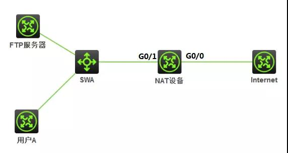

# [关于NAT hairpin 功能相关知识](https://www.cnblogs.com/sfccl/p/16104548.html)

参考：

[NAT Hairpin技术实验介绍 - 南京建策科技股份有限公司 (jiancenj.com)](http://www.jiancenj.com/1367.aspx)

[在NAT中的hairpin是什么意思_百度知道 (baidu.com)](https://zhidao.baidu.com/question/2055115012501372547.html)

[[史上最详细]H3C路由器NAT典型配置案例 - 百度文库 (baidu.com)](https://wenku.baidu.com/view/4e046e05571810a6f524ccbff121dd36a32dc4a8.html)

一、nat hairpin （端口回流或者NAT回环）功能产生的背景

1、内网主机使用域名方式访问内网服务器。

2、从安全角度，防止内网主机直接访问内网服务器（提防内鬼），必须通过防火墙绕行才允许访问内网服务器。

二、典型组网图

三、配置命令

1.配置Easy IP

[H3C]acl basic 2000

[H3C-acl-ipv4-basic-2000]rule 0 permit source 192.168.1.0 0.0.0.255

[H3C]interface GigabitEthernet 0/0

[H3C-GigabitEthernet0/0]nat outbound 2000

配置作用：将私网用户访问FTP服务器的报文中的源IP地址转换为GigabitEthernet 0/0接口的IP地址。

2.配置NAT Server

[H3C-GigabitEthernet0/0]nat server protocol tcp global 202.100.1.100 ftp inside 192.168.1.100 ftp

配置作用：将私网用户访问私网FTP服务器的报文中的目的IP地址进行转换。

3.配置NAT hairpin

[H3C]interface GigabitEthernet 0/1

[H3C-GigabitEthernet0/1]nat hairpin enable

四、测试验证命令

display nat session verbose
